# StudyBunnyAdmin Introduction

**This Repository only Include the Admin Panel for the StudyBunnies Application.**

*Full Project Link: <u>https://github.com/Sjiaseng/StudyBunnies</u>* 

<br>

StudyBunny is a Responsive E-Learning Application Targetting Various Android and iOS Users ( Mobile Phones / Tablets ) . 

<br>

**Technical Stacks:**

* FrontEnd: Dart (Flutter)

* Backend: Dart (Flutter)

* Database: FireStore NoSQL Database (Firestore Database)

* Picture Storage: Firebase Storage

* Authentication: Firebase Authentication

<br>

*<u>Note: Apk File is Included in the App-Release Zip File.</u>* 

<br>

**Various Functionalities Included:**

- User Registration & Login

- Password Reset & Notification

- Profile Modification

- Simple Summary Report

- Feedback Mechanism

- Manage Lecturers' Information

- Manage Students' Information

- Manage Classrooms

- Comment Managements

- Gift Management 

- Searching and Filtering Functions

- Timetable Generation

<br>

# Setup:

Requirements:

- Flutter SDK (Environment Version >=3.4.0 <4.0.0)
- Firebase Account
- Android Studio (Any Version)
- IDE Like VSCode, Android Studio or Xcode
- Minimum SDK Version 31

<br>

## Steps:

<br>

*Configuration of Firebase: https://firebase.google.com/docs/flutter/setup?platform=android*

<br>

Step 1:
```bash
git clone https://github.com/Sjiaseng/StudyBunnyAdmin.git
```

Step 2:
```bash
cd StudyBunnyAdmin
```

Step 3:
```bash
flutter pub get
```

Step 4:
```bash
flutter run
```

Step 5: (Optional)
```bash
flutter build apk
```

## Running Apk

<br>

**If ur using Android Emulator:**

```bash
adb install your-path/to/app-release.apk
```

<br>

**Emulator Like BlueStacks:**

1. Locate ur .apk file.

2. Drag your .apk file into the Emulator and Start Installation.

<br>

# UI Showcase

**Theme:**


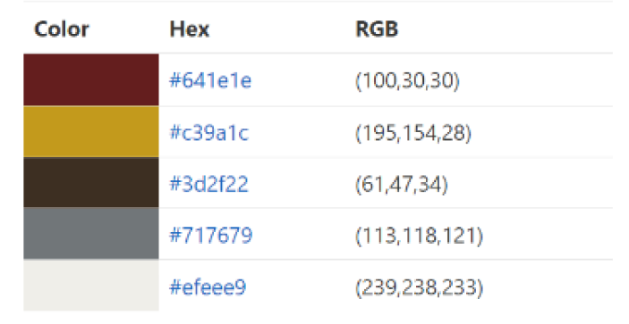 

**UI**

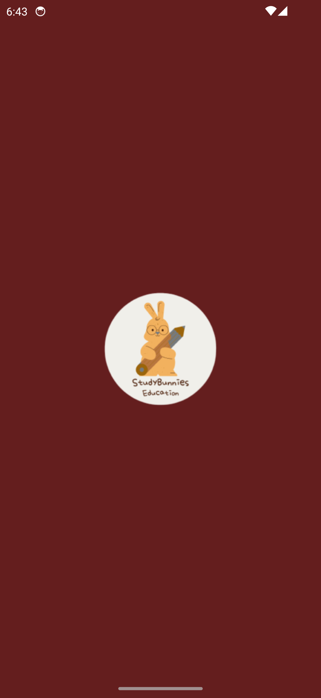 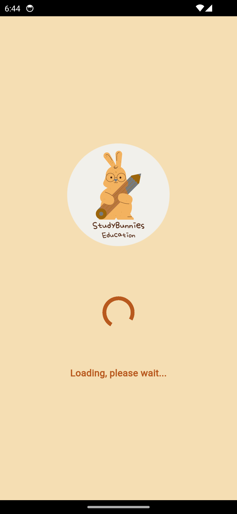 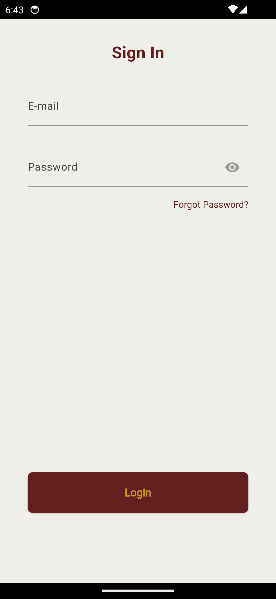 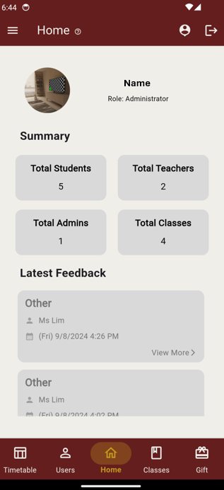 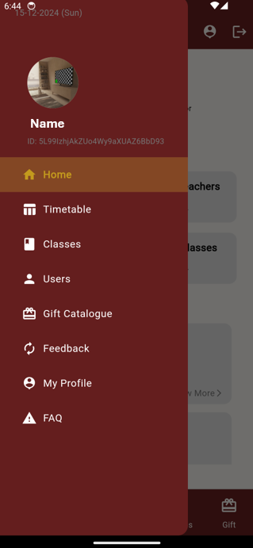 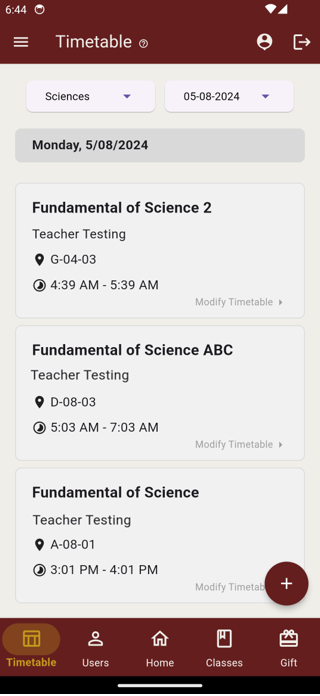 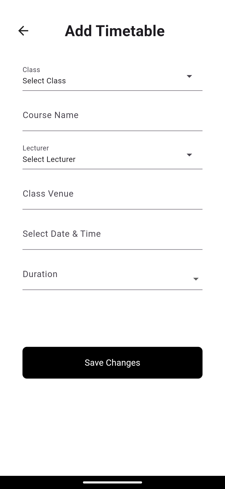 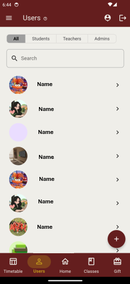 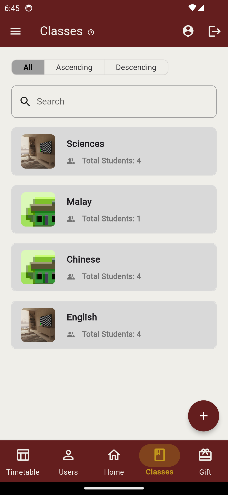 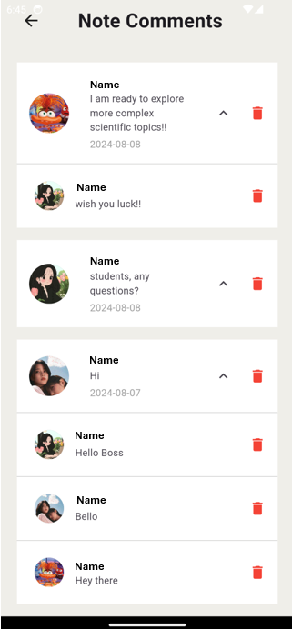 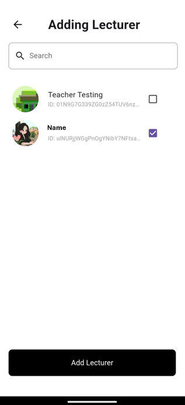 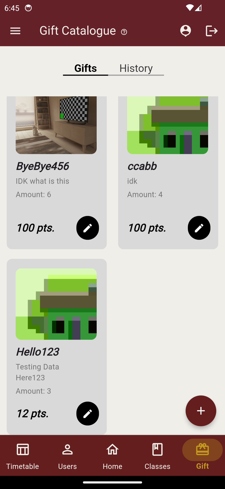 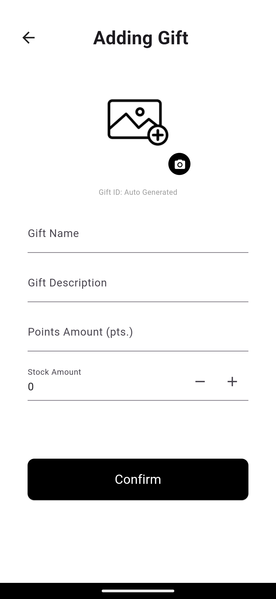 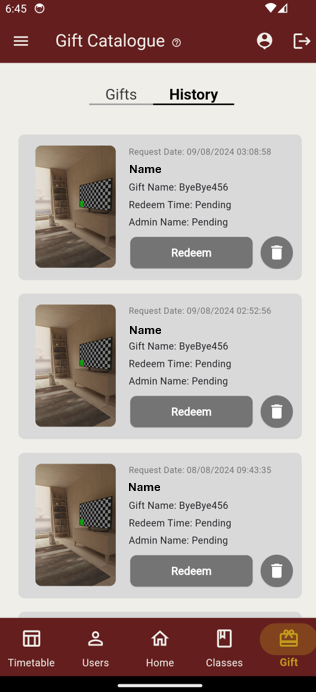 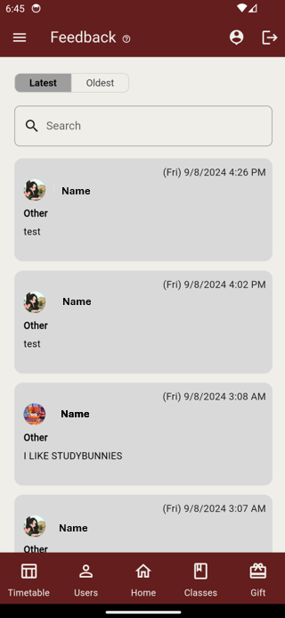 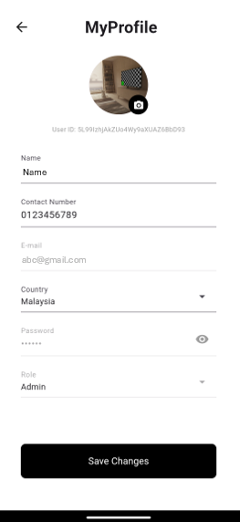 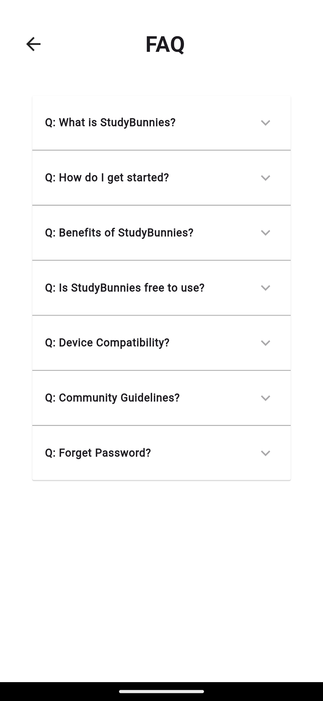 

